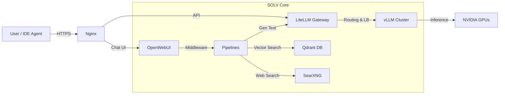

# SOLV Stack: The Enterprise Local AI Infrastructure

**SOLV Stack** (**S**earXNG, **O**penWebUI, **L**iteLLM, **V**LLM) là một giải pháp hạ tầng AI "Local-First" trọn gói, được thiết kế để triển khai LLM & Agentic Workflow trong môi trường doanh nghiệp với yêu cầu cao về bảo mật, hiệu năng và khả năng mở rộng.

Tương tự như tinh thần của **XAMPP** dành cho Web Dev, **SOLV Stack** đóng gói các công nghệ AI SOTA (State-of-the-art) thành một khối thống nhất, dễ dàng triển khai chỉ với một lệnh Docker.

---

## 🏗 Architecture

Hệ thống hoạt động theo mô hình Microservices, tối ưu hóa cho phần cứng High-End:



## 🧩 Components

| Component | Role | Description |
| --- | --- | --- |
| **S**earXNG | Web Search Tool | Công cụ tìm kiếm ẩn danh, privacy-focused. Cung cấp dữ liệu real-time cho RAG & Agents. |
| **O**penWebUI | Frontend / UI | Giao diện Chat giống ChatGPT, quản lý User, History và RAG Pipelines. |
| **L**iteLLM | API Gateway | Router trung tâm. Chuẩn hóa mọi request về OpenAI Format. Cân bằng tải và log request. |
| **V**LLM | Inference Engine | Engine chạy model nhanh nhất hiện nay. Hỗ trợ PagedAttention, Continuous Batching. |
| **Qdrant** | Vector DB | Lưu trữ Embedding cho hàng ngàn tài liệu doanh nghiệp. |
| **Pipelines** | Logic Middleware | Cho phép inject Python code để xử lý RAG, Function Calling trước khi gọi LLM. |

---

## 🚀 Quick Start

### 1. Prerequisites

* **OS:** Linux (Ubuntu 22.04/24.04 recommended)
* **GPU Driver:** NVIDIA Driver 535+ & CUDA 12.x
* **Docker:** Docker Engine + **NVIDIA Container Toolkit**

### 2. Installation

Clone repository và chuẩn bị môi trường:

```bash
git clone https://github.com/chnghia/solv-stack.git
cd solv-stack

# Tạo file môi trường từ mẫu
cp .env.example .env

```

Tải model về thư mục local (Ví dụ Qwen3):

```bash
hf download Qwen/Qwen3-Coder-30B-A3B-Instruct --local-dir ./models/Qwen3-Coder-30B


```

Khởi chạy hệ thống:

```bash
docker compose up -d

```

Truy cập:

* **Chat UI:** `http://localhost:8080`
* **API Gateway:** `http://localhost:8080/api`
* **Vector DB:** `http://localhost:8080/qdrant`
* **Web Search:** `http://localhost:8080/search`

---

## ⚙️ Configuration

### 1. Model Management (vLLM)

Để thay đổi hoặc thêm model, chỉnh sửa `docker-compose.yml` trong service `vllm-backend`:

```yaml
command: >
  --model /models/Llama-3-70B
  --tensor-parallel-size 2  # Số lượng GPU muốn dùng
  --gpu-memory-utilization 0.95

```

*Lưu ý: Cần `docker compose restart vllm-backend` sau khi đổi.*

### 2. Routing Logic (LiteLLM)

Cấu hình tại `litellm_config.yaml`. Đây là nơi bạn định nghĩa tên model mà Agent/User sẽ gọi:

```yaml
model_list:
  - model_name: gpt-4-turbo # Alias giả lập
    litellm_params:
      model: openai/llama-3-70b # Tên model trong vLLM
      api_base: http://vllm-backend:8000/v1

```

### 3. RAG Pipelines

Code logic xử lý RAG nằm trong thư mục `./pipelines`.

* Để kích hoạt search web/local doc, vào **OpenWebUI > Admin Panel > Settings > Pipelines** và bật valve tương ứng.

---

## 📂 Directory Structure

```text
solv-stack/
├── docker-compose.yml      # Master orchestration file
├── .env                    # Secrets (copy from .env.example)
├── .env.example            # Environment template
├── litellm_config.yaml     # Gateway routing config
├── nginx/                  # Nginx reverse proxy config
├── models/                 # Local LLM Weights (Mounted to vLLM)
├── pipelines/              # Python RAG logic (Mounted to Pipelines container)
├── scripts/                # Helper scripts
│   ├── download-model.sh   # Download models from HuggingFace
│   └── health-check.sh     # Check service status
├── data/                   # Persistent storage (gitignored)
│   ├── openwebui/          # User history & settings
│   ├── qdrant/             # Vector DB storage
│   └── searxng/            # Search engine config
└── README.md

```

## 🛠 Scalability & Optimization

* **Multi-GPU:** Hệ thống mặc định cấu hình `tensor-parallel-size` để chia tải model lớn lên nhiều GPU.
* **Blackwell Optimization:** Nếu sử dụng RTX 6000 Ada/Blackwell, hãy thêm flag `--kv-cache-dtype fp8` vào command vLLM để tăng gấp đôi context window/throughput.
* **Agent Ready:** LiteLLM đã được config để handle Tool Calling chuẩn OpenAI, tương thích hoàn hảo với **CrewAI**, **LangGraph**, và **VSCode Continue**.

## 📝 License

Internal Use / MIT License.

---

*Built with ❤️ by the AI Engineering Team.*