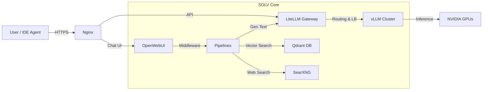

# SOLV Stack: The Enterprise Local AI Infrastructure

**SOLV Stack** (**S**earXNG, **O**penWebUI, **L**iteLLM, **V**LLM) is a complete "Local-First" AI infrastructure solution, designed to deploy LLM & Agentic Workflows in enterprise environments with high requirements for security, performance, and scalability.

Similar to the philosophy of **XAMPP** for Web Dev, **SOLV Stack** packages state-of-the-art (SOTA) AI technologies into a unified stack that can be easily deployed with a single Docker command.

---

## 🏗 Architecture

The system operates on a Microservices model, optimized for high-end hardware:



## 🧩 Components

| Component | Role | Description |
| --- | --- | --- |
| **S**earXNG | Web Search Tool | Privacy-focused, anonymous search engine. Provides real-time data for RAG & Agents. |
| **O**penWebUI | Frontend / UI | ChatGPT-like chat interface with User management, History, and RAG Pipelines. |
| **L**iteLLM | API Gateway | Central router. Normalizes all requests to OpenAI Format. Load balancing and request logging. |
| **V**LLM | Inference Engine | The fastest model inference engine available. Supports PagedAttention, Continuous Batching. |
| **Qdrant** | Vector DB | Stores embeddings for thousands of enterprise documents. |
| **Pipelines** | Logic Middleware | Allows injecting Python code to handle RAG, Function Calling before calling LLM. |

---

## 🚀 Quick Start

### 1. Prerequisites

* **OS:** Linux (Ubuntu 22.04/24.04 recommended)
* **GPU Driver:** NVIDIA Driver 535+ & CUDA 12.x
* **Docker:** Docker Engine + **NVIDIA Container Toolkit**

### 2. Installation

Clone the repository and prepare the environment:

```bash
git clone https://github.com/chnghia/solv-stack.git
cd solv-stack

# Create environment file from template
cp .env.example .env
```

Download a model to local storage (e.g., Qwen3):

```bash
# Using hf CLI
./scripts/download-model.sh Qwen/Qwen3-Coder-30B-A3B-Instruct ./models/Qwen3-Coder-30B

# Or manually
hf download Qwen/Qwen3-Coder-30B-A3B-Instruct --local-dir ./models/Qwen3-Coder-30B
```

Start the system:

```bash
docker compose up -d
```

Access the services:

* **Chat UI:** `http://localhost:8080`
* **API Gateway:** `http://localhost:8080/api`
* **Vector DB:** `http://localhost:8080/qdrant`
* **Web Search:** `http://localhost:8080/search`

---

## ⚙️ Configuration

### 1. Model Management (vLLM)

#### Option A: Replace the default model

Edit the `.env` file to change the primary model:

```bash
# .env file
VLLM_MODEL=Llama-3-70B
TENSOR_PARALLEL_SIZE=2
GPU_MEMORY_UTILIZATION=0.95
```

Then restart: `docker compose restart vllm-backend`

#### Option B: Add additional models (Multi-Model Setup)

For running multiple models simultaneously, use the `docker-compose.models.yml` file:

**Step 1:** Download additional models

```bash
# Download embedding model
./scripts/download-model.sh nomic-ai/nomic-embed-text-v1.5 ./models/nomic-embed-text-v1.5

# Download a smaller/faster model
./scripts/download-model.sh Qwen/Qwen2.5-7B-Instruct ./models/Qwen2.5-7B-Instruct
```

**Step 2:** Edit `docker-compose.models.yml` to configure GPU assignments:

```yaml
services:
  vllm-embedding:
    environment:
      - CUDA_VISIBLE_DEVICES=2  # Assign to GPU 2
    command: >
      --model /models/nomic-embed-text-v1.5
      --served-model-name "nomic-embed-text"

  vllm-small:
    environment:
      - CUDA_VISIBLE_DEVICES=3  # Assign to GPU 3
    command: >
      --model /models/Qwen2.5-7B-Instruct
      --served-model-name "qwen2.5-7b"
```

**Step 3:** Start all models together:

```bash
docker compose -f docker-compose.yml -f docker-compose.models.yml up -d
```

### 2. Routing Logic (LiteLLM)

Configure model routing in `litellm_config.yaml`. Add entries for each vLLM instance:

```yaml
model_list:
  # Main model (vllm-backend)
  - model_name: gpt-4-turbo
    litellm_params:
      model: openai/qwen3-coder-30b
      api_base: http://vllm-backend:8000/v1
      api_key: EMPTY

  # Embedding model (vllm-embedding)
  - model_name: text-embedding-3-small
    litellm_params:
      model: openai/nomic-embed-text
      api_base: http://vllm-embedding:8000/v1
      api_key: EMPTY

  # Small/fast model (vllm-small)
  - model_name: gpt-4o-mini
    litellm_params:
      model: openai/qwen2.5-7b
      api_base: http://vllm-small:8000/v1
      api_key: EMPTY
```

Restart LiteLLM after config changes: `docker compose restart litellm`

### 3. RAG Pipelines

RAG processing logic is located in the `./pipelines` directory.

* To enable web/local doc search, go to **OpenWebUI > Admin Panel > Settings > Pipelines** and enable the corresponding valves.

---

## 📂 Directory Structure

```text
solv-stack/
├── docker-compose.yml        # Master orchestration file
├── docker-compose.models.yml # Multi-model vLLM configuration
├── .env                      # Secrets (copy from .env.example)
├── .env.example              # Environment template
├── litellm_config.yaml       # Gateway routing config
├── nginx/                    # Nginx reverse proxy config
├── models/                   # Local LLM Weights (Mounted to vLLM)
├── pipelines/                # Python RAG logic (Mounted to Pipelines container)
├── scripts/                  # Helper scripts
│   ├── download-model.sh     # Download models from HuggingFace
│   └── health-check.sh       # Check service status
├── data/                     # Persistent storage (gitignored)
│   ├── openwebui/            # User history & settings
│   ├── qdrant/               # Vector DB storage
│   └── searxng/              # Search engine config
└── README.md
```

## 🛠 Scalability & Optimization

* **Multi-GPU:** The system is configured by default with `tensor-parallel-size` to distribute large models across multiple GPUs.
* **Blackwell Optimization:** If using RTX 6000 Ada/Blackwell, add the flag `--kv-cache-dtype fp8` to the vLLM command to double context window/throughput.
* **Agent Ready:** LiteLLM is configured to handle OpenAI-standard Tool Calling, fully compatible with **CrewAI**, **LangGraph**, and **VSCode Continue**.

## 📝 License

MIT License

---

*Built with ❤️ by the AI Engineering Team.*